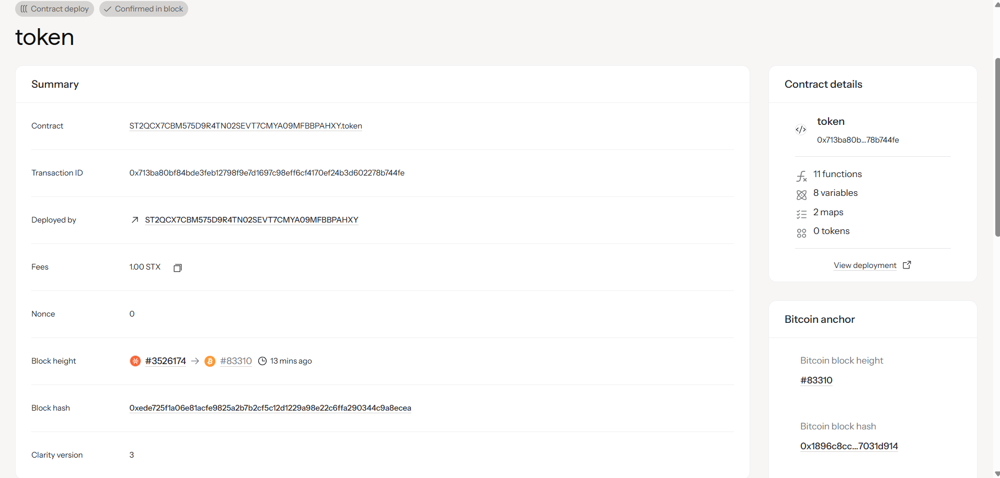

# Token Smart Contract

A simple and secure token implementation built with Clarity on the Stacks blockchain.

## Features

- **Token Minting**: Create new tokens (restricted to contract owner)
- **Token Transfer**: Transfer tokens between addresses
- **Approval System**: Allow other addresses to spend tokens on your behalf
- **Token Burning**: Destroy tokens to reduce total supply
- **Balance Tracking**: Query token balances for any address
- **Total Supply**: Track the total number of tokens in circulation

## Contract Functions

### View Functions

- `get-symbol()` - Returns the token symbol ("TKN")
- `get-name()` - Returns the token name ("MyToken")
- `get-decimals()` - Returns the token decimals (8)
- `get-balance(owner)` - Returns the balance of a specific address
- `get-allowance(owner, spender)` - Returns the allowance granted to a spender
- `get-total-supply()` - Returns the total supply of tokens

### State-Changing Functions

- `mint(amount, recipient)` - Mint new tokens to a recipient (owner only)
- `transfer(amount, sender, recipient, memo)` - Transfer tokens directly
- `approve(spender, amount)` - Approve a spender to spend tokens
- `transfer-from(amount, owner, recipient, memo)` - Transfer tokens using allowance
- `burn(amount)` - Burn tokens from sender's balance

## Error Codes

- `u1001` - Insufficient balance
- `u1002` - Insufficient allowance
- `u1003` - Not authorized (only contract owner can mint)
- `u1004` - Zero amount not allowed

## Events

- `Transfer(sender, recipient, amount)` - Emitted when tokens are transferred
- `Mint(recipient, amount)` - Emitted when new tokens are minted
- `Burn(owner, amount)` - Emitted when tokens are burned

## Usage Examples

### Minting Tokens
```clarity
(contract-call? .token mint u1000 'ST1J4G6WW6439GXCK3KMCJGF8V66BSPF1K9X95K4E)
```

### Transferring Tokens
```clarity
(contract-call? .token transfer u500 tx-sender 'ST1J4G6WW6439GXCK3KMCJGF8V66BSPF1K9X95K4E none)
```

### Approving Spender
```clarity
(contract-call? .token approve 'ST1J4G6WW6439GXCK3KMCJGF8V66BSPF1K9X95K4E u300)
```

### Transfer Using Allowance
```clarity
(contract-call? .token transfer-from u200 'ST1J4G6WW6439GXCK3KMCJGF8V66BSPF1K9X95K4E 'ST2J4G6WW6439GXCK3KMCJGF8V66BSPF1K9X95K5F none)
```

### Burning Tokens
```clarity
(contract-call? .token burn u100)
```

## Testing

Run the test suite to verify all functionality:

```bash
clarinet test
```

The test suite covers:
- Basic token functionality
- Minting operations
- Transfer operations
- Approval and transfer-from operations
- Burning operations
- Total supply tracking

## Security Features

- **Owner-only minting**: Only the contract deployer can mint new tokens
- **Balance checks**: All transfers verify sufficient balance
- **Allowance management**: Proper allowance tracking for delegated transfers
- **Input validation**: Zero amounts are rejected
- **Authorization checks**: Only authorized users can perform restricted operations

## Deployment

### Quick Start

1. **Set up testnet configuration**:
   ```bash
   # Edit settings/Testnet.toml and add your mnemonic
   # Get testnet STX from https://faucet.hiro.so/
   ```

2. **Deploy to testnet**:
   ```bash
   ./deploy-testnet.sh
   ```

### Detailed Instructions

For complete deployment instructions, see [DEPLOYMENT.md](./DEPLOYMENT.md).

### Prerequisites

- Clarinet CLI installed
- Testnet STX (get from [Hiro Faucet](https://faucet.hiro.so/))
- Wallet with mnemonic phrase

### Deployment Options

- **Testnet**: `./deploy-testnet.sh` (recommended for testing)
- **Devnet**: `clarinet integrate` (local development)
- **Mainnet**: Follow the deployment guide (production)

### Deployed


## License

This project is open source and available under the MIT License.
